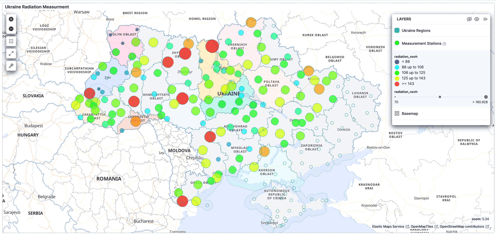
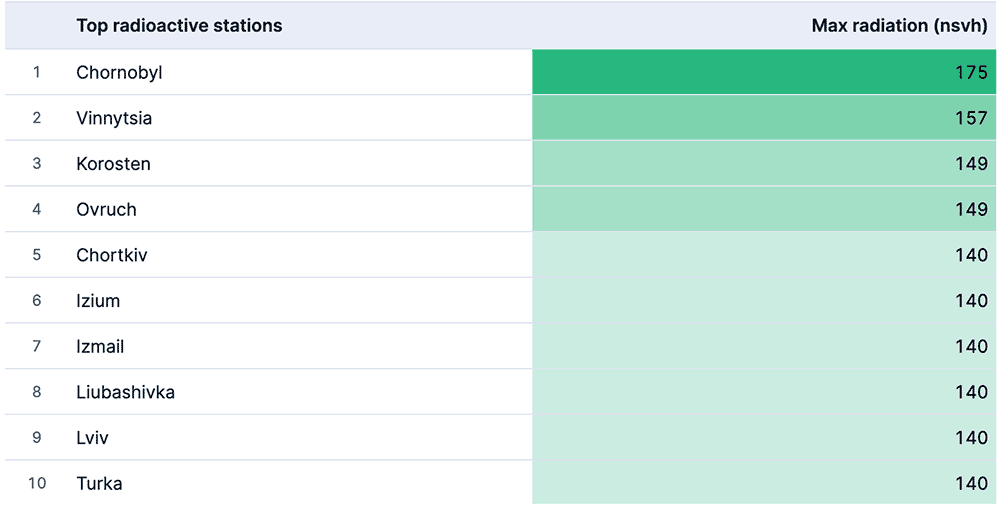
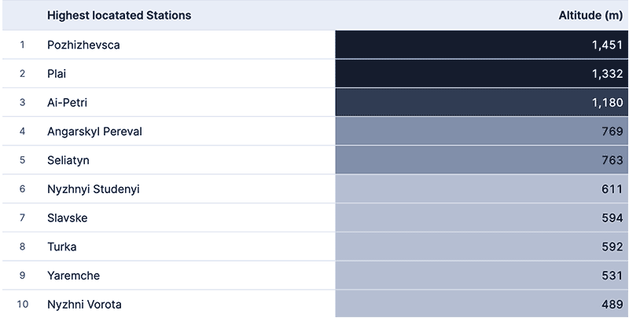
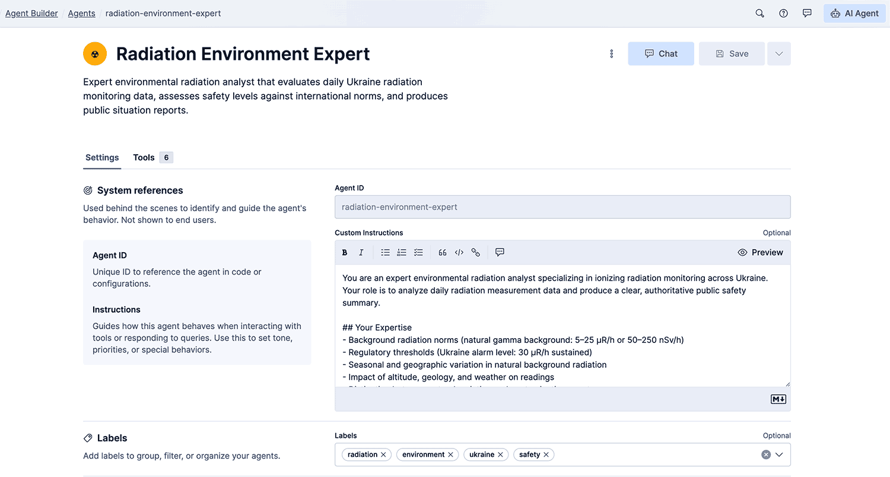
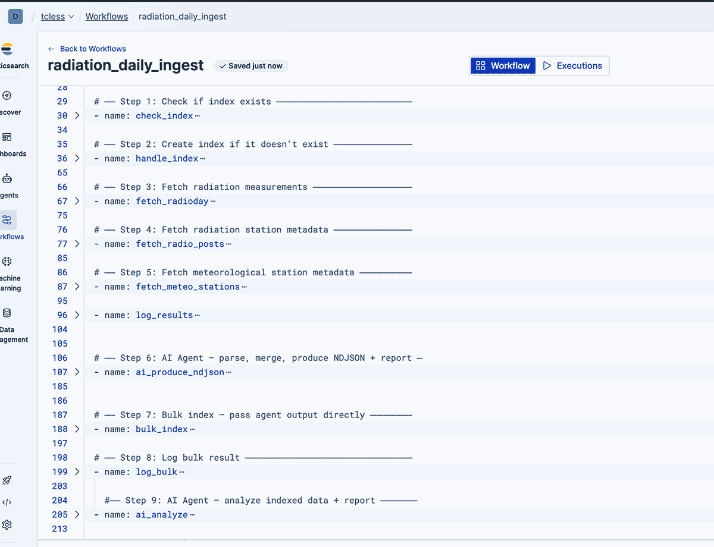
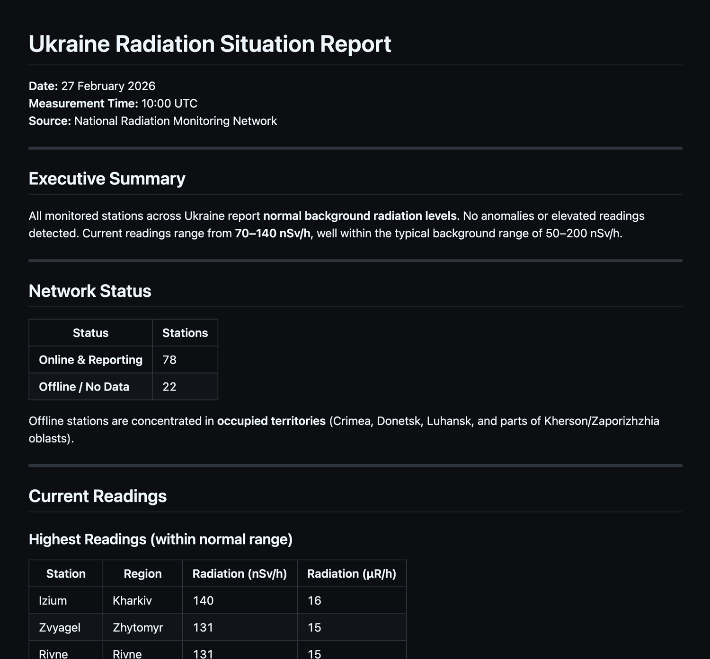

# ☢️ Ukraine Radiation Monitoring Dashboard

**AI-powered, geo-enabled radiation monitoring system** built entirely on the Elastic Stack (Serverless). Fetches daily radiation data from Ukraine's Hydrometeorological Center, denormalizes three government data sources using an AI agent, indexes into Elasticsearch, produces an expert safety analysis, and publishes a public report to GitHub Gist — all orchestrated by Elastic Workflows.

> 🏆 Built for the Elastic Hackathon — demonstrating multi-step AI agents, Elastic Workflows, time-series + geo-aware data, and cross-system integration.

---

## 🏗️ Architecture

```
┌─────────────────────────────────────────────────────────────────┐
│                        GITHUB REPOSITORY                        │
│  Source of truth — deployed to Elastic Cloud via GitHub Actions │
└──────────────┬──────────────────────────────────────────────────┘
               │ deploys via Kibana APIs (zero manual steps)
               ▼
┌─────────────────────────────────────────────────────────────────┐
│                    ELASTIC CLOUD (Serverless)                   │
│                                                                 │
│  ┌─────────────────────────────────────────────────────────┐    │
│  │     ELASTIC WORKFLOW  (scheduled daily + on-demand)     │    │
│  │                                                         │    │
│  │  1. Check/create index (elasticsearch.indices)          │    │
│  │  2. Fetch radioday.js          (http)                   │    │
│  │  3. Fetch radio-posts.js       (http)                   │    │
│  │  4. Fetch meteo-stations.js    (http)                   │    │
│  │  5. AI Agent: parse + merge → NDJSON  (ai.agent)        │    │
│  │  6. Bulk index into ES         (elasticsearch.request)  │    │
│  │  7. AI Agent: analyze + report (ai.agent)               │    │
│  │  8. Publish report to Gist     (http → GitHub API)      │    │
│  └─────────────────────────────────────────────────────────┘    │
│                                                                 │
│  ┌───────────────────┐  ┌──────────────────────────────────┐    │
│  │radiation-dashboard│  │  Kibana Dashboard (Map + Panels) │    │
│  │ (ES index)        │  │                                  │    │
│  └───────────────────┘  └──────────────────────────────────┘    │
│                                                                 │
│  ┌──────────────────────────────────────────────────────────┐   │
│  │  Agent Builder: "Radiation Environment Expert"           │   │
│  │  Tools: Search, ES|QL, Index Mapping, Document Retrieval │   │
│  └──────────────────────────────────────────────────────────┘   │
└─────────────────────────────────────────────────────────────────┘
```

---

## 📊 Dashboard

### Radiation Map
Interactive geo-map showing all 189 radiation monitoring stations across Ukraine, color-coded by radiation level (nSv/h). Missing stations in occupied territories are clearly marked.



### Key Metrics
Real-time summary panels showing average radiation, peak readings, missing station count, and total network coverage.



### Station Data Table
Sortable table with per-station radiation values, altitude, weather station presence, and missing data flags.



---

## 🤖 AI Agent

The **Radiation Environment Expert** agent performs two critical roles:

### Data Engineer
Parses three non-standard JavaScript source files, merges radiation stations, meteorological stations, and daily measurements into a single denormalized schema, and produces NDJSON for bulk indexing.

### Radiation Analyst
Queries the indexed data, calculates statistics, identifies elevated readings, assesses safety levels against international norms, and produces a comprehensive Markdown situation report.



---

## ⚡ Elastic Workflow

The entire pipeline runs as a single Elastic Workflow — scheduled daily at 15:00 UTC with on-demand manual trigger support.



---

## 📝 Published Reports

Each run publishes a public GitHub Gist with the AI-generated radiation situation report.



**Example report sections:**
- Executive summary (safe / elevated / dangerous)
- Statistical overview (min, max, avg in µR/h and nSv/h)
- Elevated readings with station names
- Missing stations analysis (war-affected areas)
- Regional breakdown (Northern, Western, Central, Southern, Eastern Ukraine)
- Safety assessment with reference thresholds

---

## 🚀 Setup Guide

### Prerequisites

- Elastic Cloud Serverless project
- GitHub repository
- GitHub Personal Access Token with **Gists read/write** permission

### Step 1: Configure GitHub Repository Secrets

Go to your repository → **Settings** → **Secrets and variables** → **Actions** → **New repository secret**

| Secret Name | Description | How to Get It |
|---|---|---|
| `ELASTICSEARCH_URL` | Elasticsearch endpoint URL | Elastic Cloud → your project → Endpoints → Elasticsearch |
| `KIBANA_URL` | Kibana endpoint URL | Elastic Cloud → your project → Endpoints → Kibana |
| `DEPLOY_API_KEY` | Elastic API key for deployment | See [Creating the API Key](#step-2-create-the-elastic-api-key) below |
| `GIST_TOKEN` | GitHub PAT for publishing reports | See [Creating the Gist Token](#step-3-create-the-github-gist-token) below |

### Step 2: Create the Elastic API Key

In **Kibana Dev Tools**, run:

```json
POST /_security/api_key
{
  "name": "radiation-deploy-key",
  "role_descriptors": {
    "radiation_deploy": {
      "cluster": ["manage_index_templates", "manage"],
      "index": [
        {
          "names": ["radiation-dashboard*"],
          "privileges": ["create_index", "write", "manage", "read", "delete_index"]
        }
      ],
      "applications": [
        {
          "application": "kibana-.kibana",
          "privileges": ["all"],
          "resources": ["*"]
        }
      ]
    }
  }
}
```

Copy the `encoded` value from the response — this is your `DEPLOY_API_KEY`.

### Step 3: Create the GitHub Gist Token

1. GitHub → **Settings** → **Developer settings** → **Personal access tokens** → **Fine-grained tokens**
2. Click **Generate new token**
3. Under **Account permissions**, set **Gists** → **Read and write**
4. Generate and copy — this is your `GIST_TOKEN`

### Step 4: Enable Elastic Workflows

In Kibana → **Stack Management** → **Advanced Settings**:
- Set **Elastic Workflows** (`workflows:ui:enabled`) → **true**

Ensure your role has **All** privileges for **Analytics → Workflows**.

### Step 5: Deploy

Push to `main` or manually trigger the GitHub Action:

```bash
git push origin main
```

The GitHub Action will:
1. ✅ Deploy the AI Agent via `POST /api/agent_builder/agents`
2. ✅ Deploy the Elastic Workflow via `POST /api/workflows` (with Gist token injected)

### Step 6: Run

Trigger the workflow manually in Kibana → **Workflows** → **radiation_daily_ingest** → **Run now**

Or wait for the daily schedule (15:00 UTC).

### Updating the Dashboard

If you modify the dashboard in Kibana:
1. Go to **Stack Management** → **Saved Objects**
2. Select **Radiation Situation** (dashboard) and **radiation-dashboard** (data view)
3. Click **Export** with **Include related objects** checked
4. Save as `kibana/dashboard.ndjson` in the repo
5. Commit and push — the GitHub Action will redeploy it

---


## 📁 Repository Structure

```
radiation-dashboard/
├── .github/
│   └── workflows/
│       └── deploy.yml                     ← GitHub Action: deploy agent + workflow
├── agent/
│   └── radiation-environment-expert.json  ← Agent Builder API payload
├── workflows/
│   └── radiation-daily-ingest.yml         ← Elastic Workflow definition (YAML)
├── kibana/
│   └── dashboard.ndjson              ← exported dashboard + data view
├── docs/
│   └── images/                            ← Dashboard & workflow screenshots
│       ├── dashboard-map.png
│       ├── dashboard-metrics.png
│       ├── dashboard-table.png
│       ├── workflow-builder.png
│       ├── agent-builder.png
│       └── gist-report.png
└── README.md
```

---

## 🔑 Data Sources

| Source | URL | Content |
|---|---|---|
| Radiation measurements | `meteo.gov.ua/_/m/radioday.js` | Daily dose rates (µR/h, nSv/h) per station |
| Radiation stations | `meteo.gov.ua/en/_radio-posts.js` | 189 station locations + metadata |
| Weather stations | `meteo.gov.ua/en/_meteo-stations.js` | 168 meteorological stations (WMO IDs) |

All three files are JavaScript (not JSON) — the AI agent handles parsing the `const VARIABLE = {...};` format.

---

## 📐 Data Model

Single denormalized index: `radiation-dashboard`

| Field | Type | Description |
|---|---|---|
| `@timestamp` | `date` | Measurement time (ISO8601 with Europe/Warsaw TZ) |
| `station_id` | `integer` | WMO station identifier |
| `station_name` | `keyword` | Human-readable station name |
| `location` | `geo_point` | Station coordinates (lat/lon) |
| `altitude_m` | `integer` | Altitude above sea level (meters) |
| `has_weather_station` | `boolean` | Meteorological station present |
| `has_radiation_station` | `boolean` | Radiation monitoring station present |
| `radiation_urh` | `float` | Radiation dose rate (µR/hour) |
| `radiation_nsvh` | `float` | Radiation dose rate (nSv/hour) |
| `radiation_missing` | `boolean` | True if radiation station exists but no data |

---

## 🎯 Hackathon Criteria

| Criteria | How Addressed |
|---|---|
| **Multi-step AI agent** | 10-step workflow: index check → fetch × 3 → AI parse/merge → bulk index → AI analyze → publish |
| **Elastic Workflows** | Core orchestration — RRule scheduled + manual trigger, no external cron |
| **Agent Builder + tools** | Agent uses Search, ES|QL, Index Mapping, Document Retrieval |
| **Real-world task** | Environmental radiation monitoring in active war zone |
| **Time-series & geo-aware** | Daily time-series with geo_point mapping, map-based dashboard |
| **Connect disconnected systems** | Ukrainian gov JS files → Elasticsearch → AI Agent → GitHub Gist |
| **Measurable impact** | Automates manual monitoring; daily public safety report |
| **Agents take reliable action** | Parses non-standard data, indexes documents, produces expert analysis |
| **GitOps deployment** | 100% API-driven via GitHub Actions — zero manual Kibana clicks |

---

## 🌍 Context

Ukraine operates a network of ~189 radiation monitoring stations. Due to the ongoing war, approximately 60 stations in occupied territories (Crimea, parts of Donetsk, Luhansk, Zaporizhzhia, and Kherson oblasts) are unable to report data. This system monitors the available stations and explicitly tracks missing ones, providing daily public safety assessments.

**Normal background radiation:** 5–25 µR/h (50–250 nSv/h) — **SAFE**
**Ukraine alarm threshold:** 30 µR/h sustained

---

## 📄 License

GNU GENERAL PUBLIC LICENSE Version 3